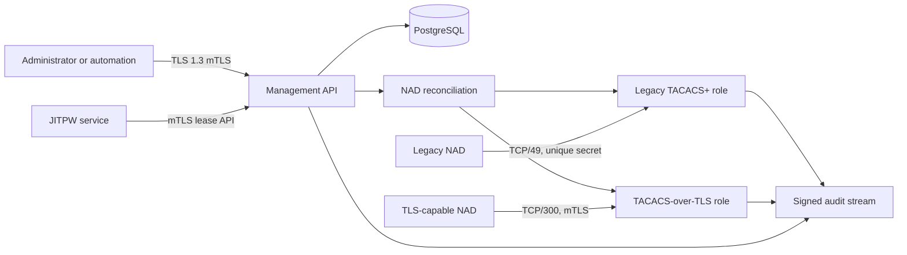

# USG TACACS

[](https://github.com/192d-Wing/usg-tacacs/actions/workflows/ci.yml)
[](./docs/nist-control-analysis.md)
[](./docs/NASA-POWER-OF-10-COMPLIANCE.md)

USG TACACS is a hardened Rust implementation of TACACS+ for administering
network devices. It supports RFC 9887 TACACS+ over TLS 1.3 and legacy TACACS+
for devices that cannot use TLS. Production deployments run as separate
management, legacy, and TLS workloads on Kubernetes.

The service integrates with JITPW for NAD-bound, short-lived device
credentials. TACACS stores a keyed verifier rather than a recoverable password;
the temporary password is not displayed to the user or exposed to the bastion.

## Capabilities

- RFC 8907 TACACS+ authentication, authorization, and accounting
- RFC 9887 TACACS+ over TLS 1.3 with mutual authentication
- Legacy TCP/49 support with unique per-NAD secrets and source enforcement
- Strict typed `TacacsServer` configuration in declarative YAML
- Deny-by-default, group- and user-aware command authorization
- Separate TLS 1.3 mTLS Management API with RBAC
- OpenAPI 3.1.1 contracts and protected Swagger UI
- API-owned NAD lifecycle with idempotency, ETags, and reconciliation
- JITPW password leases bound to a canonical EID and NAD for at most 15 minutes
- PostgreSQL-backed management state and JIT lease verifiers
- HMAC-signed, hash-chained forensic NAD audit records
- LDAPS and ICAM/OIDC authentication integrations
- Helm deployment with independent management, legacy, and TLS workloads
- EST certificate enrollment and renewal
- Prometheus metrics and OpenTelemetry tracing

## Architecture



The Management API is a USG TACACS administrative interface. It is separate
from the JITPW user API. YAML owns the reviewed baseline; the Management API
owns resources explicitly created through administrative workflows. Runtime
reconciliation validates both sources and publishes the active NAD snapshot.

## Configuration

Production configuration is one strictly validated YAML document:

```yaml
apiVersion: tacacs.usg.mil/v1alpha1
kind: TacacsServer
metadata:
  name: lab
  description: Lab TACACS service
spec:
  role: management
  listeners:
    health: 0.0.0.0:8080
  nads:
    - name: oopl-an-001
      description: IOS-XE lab switch
      sourceAddress: 192.0.2.10
      mode: legacy
      secretFile: /run/secrets/nads/oopl-an-001
  authorization:
    defaultAllow: false
    rules: []
  management:
    listener:
      address: 0.0.0.0:8443
      certificateFile: /run/secrets/management/tls.crt
      privateKeyFile: /run/secrets/management/tls.key
      clientCaFile: /run/secrets/management/client-ca.crt
      minimumVersion: "1.3"
    rbac:
      roles: {}
      subjects: []
  audit:
    hmacKeyFile: /run/secrets/audit/hmac-key
```

Use [`docs/config/server.example.yaml`](./docs/config/server.example.yaml) as
the starting point. Fields that end in `File` are container paths populated by
a Secret volume or approved CSI provider. Never put secret values in YAML,
Helm values, ConfigMaps, command lines, or logs.

Validate configuration before deployment:

```shell
cargo run --locked -p usg-tacacs-config --bin usg-tacacs-config-check -- \
  ./docs/config/server.example.yaml
```

Use `--check-files` only in an environment where every referenced secret and
certificate has been mounted.

## Kubernetes deployment

The supported chart is under [`deploy/charts/usg-tacacs`](./deploy/charts/usg-tacacs).
Site-specific, non-secret values belong under `deploy/sites/<site-name>`;
only [`deploy/sites/example`](./deploy/sites/example) is tracked.

```shell
helm lint deploy/charts/usg-tacacs

helm template usg-tacacs deploy/charts/usg-tacacs \
  --namespace usg-tacacs \
  --values deploy/sites/example/usg-tacacs.values.yaml
```

Provision PostgreSQL, migrations, certificates, NAD secrets, the JIT verifier
key, and the audit key through approved secret-management workflows before
installing. Kubernetes Secrets are not Helm values and must not be committed.

See [`deploy/README.md`](./deploy/README.md) and the
[Operator guide](./docs/docs/operator/index.md) for the production procedure.

## Management API

The management role exposes the administrative API, OpenAPI 3.1.1 contract,
and Swagger UI. Production access requires direct TLS 1.3 mutual
authentication and explicit RBAC. An HTTP header cannot substitute for a
validated client certificate.

NAD mutations require:

- a UUID in `X-Correlation-ID`;
- `Idempotency-Key` for create; and
- the current ETag in `If-Match` for update and delete.

An accepted mutation is desired state. Confirm
`GET /api/mgmt/v1/nads/reconciliation` before treating the NAD as active.

See the [Management API guide](./docs/docs/admin/management-api.md),
[architecture](./docs/api/mgmt/architecture.md), and
[OpenAPI contract](./docs/api/mgmt/openapi.yaml).

## JITPW integration

For a managed NAD, USG TACACS authenticates only against an active, unrevoked
JIT lease bound to the exact canonical lowercase EID and NAD. Authentication
fails closed if the lease store or required verifier material is unavailable;
LDAP, ICAM, and static fallback are prohibited for that managed NAD.

See [JIT password leases](./docs/docs/admin/jit-leases.md).

## Development

The workspace contains:

| Crate | Purpose |
| --- | --- |
| `tacacs-proto` | TACACS+ protocol codec |
| `tacacs-policy` | Authorization policy engine |
| `tacacs-config` | Typed YAML model and configuration checker |
| `tacacs-secrets` | Secret and certificate integrations |
| `tacacs-server` | Data plane, Management API, reconciliation, and JIT authentication |
| `tacacs-policy-ingest` | Policy-ingest service |
| `tacacs-client-tls` | TACACS-over-TLS client library |
| `tacacs-openssh` | OpenSSH integration helpers |
| `tacacs-audit` | Audit signing and forwarding |

Common checks:

```shell
cargo fmt --all --check
cargo clippy --workspace --all-targets --all-features -- -D warnings
cargo test --workspace --all-features
```

CI also enforces project safety and compliance checks. See
[Development setup](./docs/docs/dev_setup.md).

## Documentation

Choose the guide for your role:

- [Administrator guide](./docs/docs/admin/index.md) — architecture,
  configuration, trust, authorization, RBAC, secrets, and deployment design
- [Operator guide](./docs/docs/operator/index.md) — health, changes, upgrades,
  backup/recovery, monitoring, and production troubleshooting
- [NAD lifecycle runbook](./docs/docs/operator/nad-lifecycle.md) — create,
  reconcile, rotate, disable, and delete NADs
- [Forensic incident response](./docs/docs/operator/incident-response.md) —
  evidence preservation, audit integrity, and key compromise
- [User guide](./docs/docs/user/index.md) — CAC/JITPW access, `jit-ssh`,
  identity rules, and user troubleshooting
- [Developer guide](./docs/docs/dev/index.md) — implementation and protocol
  development

Build the Zensical documentation site:

```shell
cd docs
uv run zensical build
```

## Security

Do not report security vulnerabilities in public issues. Follow
[`SECURITY.md`](./SECURITY.md) and review the
[hardening guide](./docs/HARDENING_GUIDE.md) before production deployment.

This project is licensed under the [Apache License 2.0](./LICENSE).
