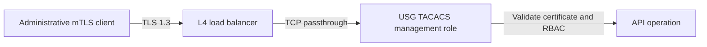

# Management mTLS and load balancers

USG TACACS authenticates Management API clients from the certificate validated
by its own TLS 1.3 listener. An HTTP reverse proxy cannot replace that identity
with `X-User-CN`, `X-Forwarded-Client-Cert`, or another header.

## Supported design

The load balancer may select a healthy replica but must preserve the TLS stream
unchanged. Terminating and re-originating HTTPS destroys end-to-end client
certificate authentication unless a separately designed cryptographic
delegation protocol exists; ordinary forwarding headers are insufficient.

## Kubernetes

- Expose only port 8443 for management.
- Apply namespace and Pod-label NetworkPolicy selectors.
- Keep health probes separate from authenticated management operations.
- Do not expose Swagger publicly.
- Do not enable service-mesh HTTP termination on the management port.
- Verify that certificate failures reach USG TACACS and are not converted into
  an authenticated proxy identity.

## Validation

1. Authorized certificate and permission succeeds.
2. Authorized identity without permission receives `403`.
3. Untrusted, expired, or absent client certificate fails TLS.
4. A spoofed identity header does not change the result.
5. Ambiguous certificate identity fails closed.
6. TLS below 1.3 fails.
7. Requests remain correlated and audited through load balancing.

If organizational ingress cannot provide TCP passthrough, expose the
management Service through a controlled private network rather than weakening
the client-authentication boundary.
