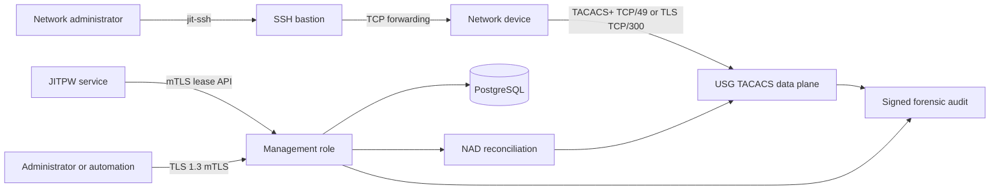

# USG TACACS documentation

USG TACACS is a hardened Rust TACACS+ service for centralized network-device
authentication, command authorization, and accounting. It supports both modern
TACACS+ over TLS 1.3 and legacy TACACS+ for devices that cannot use TLS.

Production deployments use one image in independent `management`, `legacy`,
and optional `tls` Kubernetes workloads. The service uses typed declarative
YAML, PostgreSQL-backed administrative state, strict mTLS/RBAC for management,
and signed forensic audit records.

## Choose your guide

<div class="grid cards" markdown>

-   :lucide-shield-alert:{ .lg .middle } **Administrator**

    ---

    Design the deployment, typed YAML, authorization policy, management RBAC,
    certificates, secrets, and JITPW integration.

    [:octicons-arrow-right-24: Administrator guide](admin/index.md)

-   :lucide-server-cog:{ .lg .middle } **Operator**

    ---

    Run health checks, reconcile NADs, deploy upgrades, restore service, monitor
    audit integrity, and respond to incidents.

    [:octicons-arrow-right-24: Operator guide](operator/index.md)

-   :lucide-user:{ .lg .middle } **Network user**

    ---

    Connect with CAC/JITPW and `jit-ssh`, understand identity and lease rules,
    and collect useful non-secret troubleshooting information.

    [:octicons-arrow-right-24: User guide](user/index.md)

-   :lucide-code-xml:{ .lg .middle } **Developer**

    ---

    Build the Rust workspace, understand protocol behavior, and contribute
    changes under the project's safety checks.

    [:octicons-arrow-right-24: Developer guide](dev/index.md)

</div>

## System overview



The JITPW API and USG TACACS Management API are separate interfaces. JITPW
authorizes and issues short-lived access. The Management API administers the
TACACS service and NAD desired state.

## Security model

- Management requires TLS 1.3 mutual authentication and explicit RBAC.
- TLS-capable NADs use certificate identity on TCP/300.
- Legacy NADs use an exact source mapping and a unique external shared-secret
  file on TCP/49.
- Authorization and management RBAC are independent and deny-by-default.
- YAML-owned baseline resources cannot be mutated through the API.
- API-owned changes require correlation, idempotency or ETag concurrency, and
  successful reconciliation.
- JIT passwords expire within 15 minutes, are NAD-bound, and are stored only as
  keyed verifiers.
- Secret values and temporary passwords are never returned through management
  interfaces or written to audit records.
- Audit records are HMAC-signed and hash-chained before centralized retention.

## Typed configuration

The authoritative server configuration is a strict `TacacsServer` YAML
document:

```yaml
apiVersion: tacacs.usg.mil/v1alpha1
kind: TacacsServer
metadata:
  name: lab
  description: Lab TACACS service
spec:
  role: management
  listeners:
    health: 0.0.0.0:8080
  nads:
    - name: oopl-an-001
      description: IOS-XE lab switch
      sourceAddress: 192.0.2.10
      mode: legacy
      secretFile: /run/secrets/nads/oopl-an-001
  authorization:
    defaultAllow: false
    rules: []
  management:
    listener:
      address: 0.0.0.0:8443
      certificateFile: /run/secrets/management/tls.crt
      privateKeyFile: /run/secrets/management/tls.key
      clientCaFile: /run/secrets/management/client-ca.crt
      minimumVersion: "1.3"
    rbac:
      roles: {}
      subjects: []
  audit:
    hmacKeyFile: /run/secrets/audit/hmac-key
```

Start with the repository's
[`docs/config/server.example.yaml`](https://github.com/192d-Wing/usg-tacacs/blob/main/docs/config/server.example.yaml).
Paths such as `secretFile` refer to read-only files mounted inside the
container. They are not secret values and are not paths on the administrator's
workstation.

## Deployment path

1. Define reviewed, non-secret site values.
2. Provision PostgreSQL and apply migrations with a dedicated migration role.
3. Provision management/data-plane certificates and external secret files.
4. Validate typed configuration, including mounted files.
5. Render, review, and install the Helm chart.
6. Verify management mTLS, NAD reconciliation, AAA, and signed audit delivery.

Continue with the [Administrator guide](admin/index.md) for design or the
[Operator guide](operator/index.md) for the production runbook.

## Management API

The management workload serves:

- a dedicated administrative REST API;
- its OpenAPI 3.1.1 contract;
- protected Swagger UI;
- NAD desired-state and reconciliation endpoints; and
- bounded forensic audit export and verification.

An accepted NAD mutation is not proof the device is active. Always verify
reconciliation and run an authentication, authorization, and accounting test.

See [Management API](admin/management-api.md) and
[NAD lifecycle](operator/nad-lifecycle.md).

## Operational priorities

Monitor more than Pod readiness:

- authenticated management status;
- reconciliation conflicts and secret-resolution failures;
- real NAD source-address preservation;
- synthetic legacy and TLS AAA tests;
- PostgreSQL availability and TLS validation;
- configuration hashes and certificate expiry; and
- signed audit delivery, sequence, and integrity.

If audit integrity fails, preserve evidence before restarting workloads,
rotating keys, or changing the database. Follow
[Forensic incident response](operator/incident-response.md).
